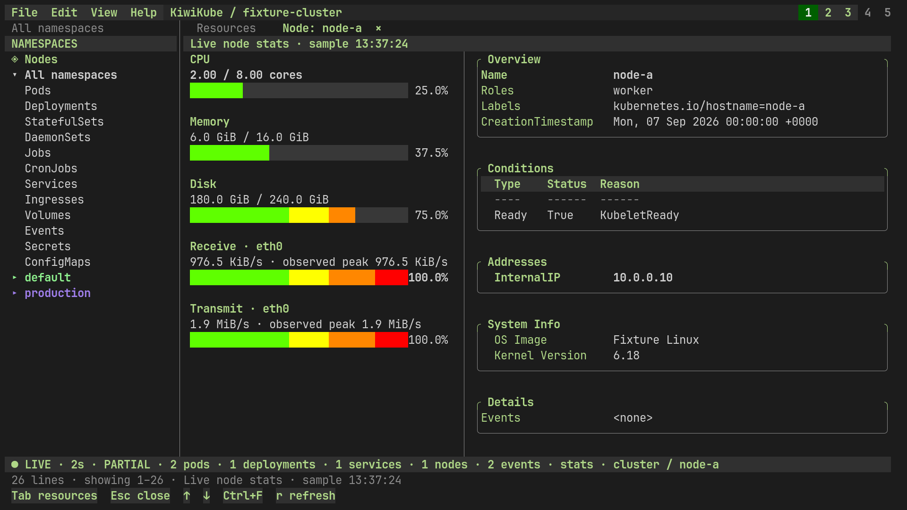
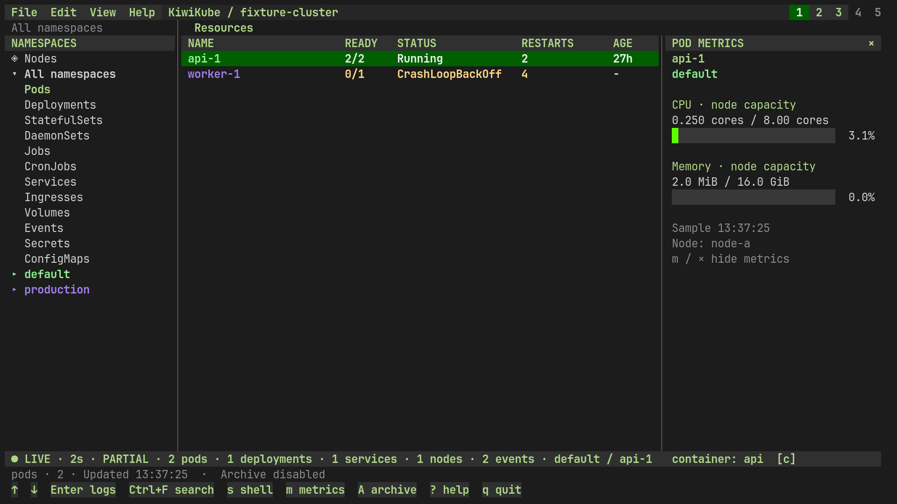
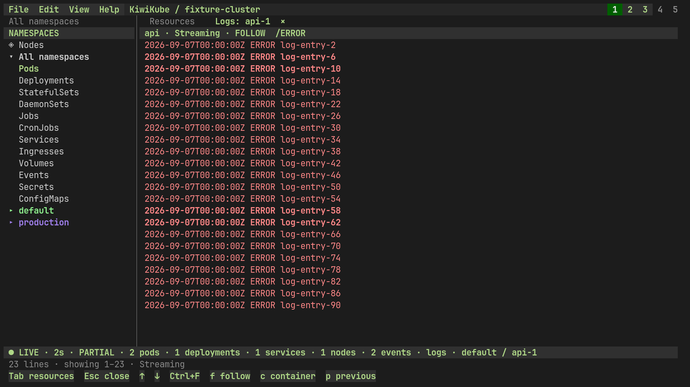
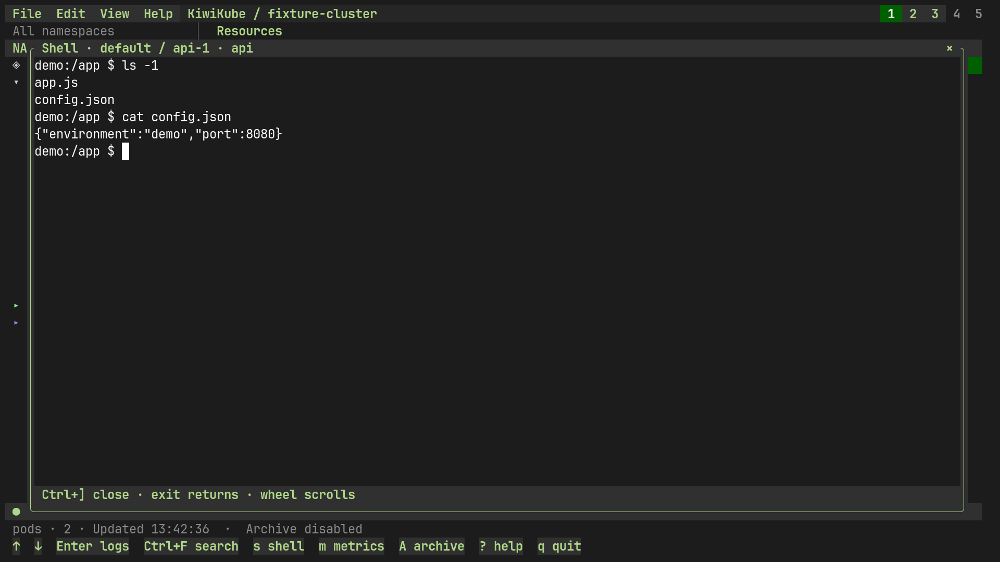
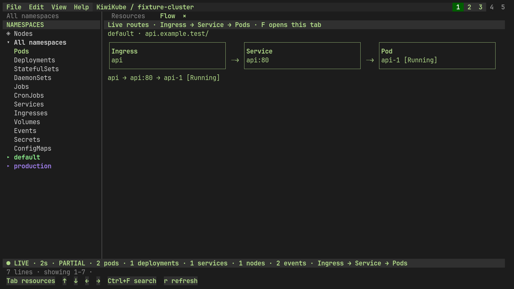

<p align="center">
  
</p>

<h1 align="center">KiwiKube</h1>

<p align="center"><strong>Take the helm of your Kubernetes clusters.</strong></p>
<p align="center">A Linux terminal dashboard with live resources, searchable history, and shells at your fingertips.</p>

<p align="center">
  <a href="LICENSE"></a>
  <a href="go.mod"></a>
  <a href="#contributing"></a>
</p>

<p align="center">
  <a href="#screenshots">Screenshots</a> ·
  <a href="#quick-start">Quick start</a> ·
  <a href="docs/guide.md">Guide</a> ·
  <a href="#contributing">Contributing</a>
</p>

## Screenshots

**Node stats** — CPU, memory, disk, network, and node details.



<details>
<summary>Pod management, error search, shells, and routing</summary>

**Pod management** — readiness, restarts, containers, and metrics (`m`).



**Find errors** — open pod logs, then Ctrl+F → `ERROR` → Enter.



**Shell access** — `s` opens a pod shell; `exit` or Ctrl+] returns. `S` opens node SSH.



**Routing** — Ingress → Service → Pod (`F`).



</details>

*Demo data. Network gauges scale to the observed peak.*

## Quick start

Build: Go 1.27, a C compiler, pkg-config, and libvterm 0.3+ headers.
Run: Linux, `kubectl`, `stty`, and SQLite 3.38+ with FTS5. SSH is optional.
[Package details](docs/guide.md#requirements).

```sh
git clone https://github.com/bradlnz/kiwikube.git
cd kiwikube
./build.sh
./kiwikube
```

Uses your kubeconfig. Switch clusters with **Alt+1–5**; press **?** for help.
Local history records by default.

[Controls, themes, history, and performance →](docs/guide.md)

## Contributing

[Issues](https://github.com/bradlnz/kiwikube/issues) and pull requests welcome.
[Development checks](docs/guide.md#checks) · [MIT License](LICENSE).
